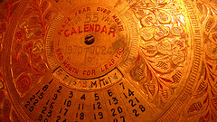
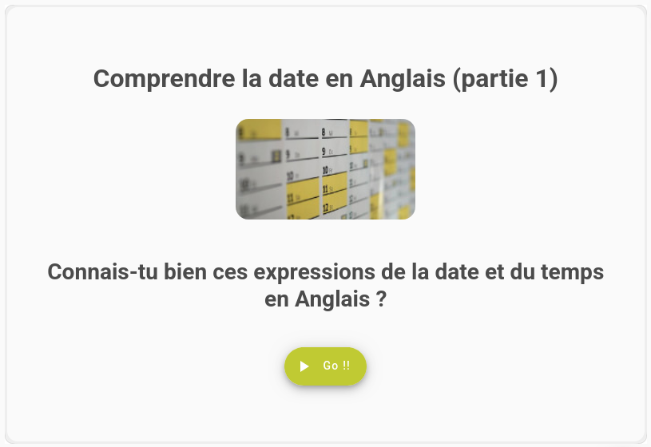
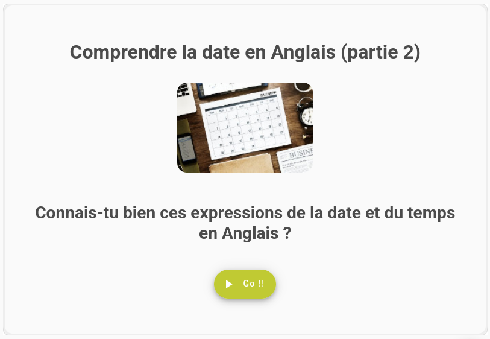

::: {layout="[30,70]"}

In this lesson you're going to hit the ground running -- in the first five minutes you'll see a complete end to end example of training and using a model  
Bla bla bla slkfdjs flqsdf jslqkfj qslmdfkj qslmfj  
eins zwei drei
:::
&nbsp;  
&nbsp;

## Liste: le vocabulaire pour parler des dates en anglais

Voici une liste des expressions anglaises les plus courantes pour parler de la date et du temps.

| Anglais                  | Français                  |
| ------------------------ | ------------------------- |
| century                  | siècle                    |
| year                     | an, année                 |
| a leap-year              | année bissextile          |
| today                    | aujourd'hui, de nos jours |
| yesterday                | hier                      |
| tomorrow                 | demain                    |
| the day before yesterday | avant-hier                |
| the day after tomorrow   | après-demain              |
| spring                   | printemps                 |
| summer                   | été                       |
| autumn                   | automne                   |
| fall [am.]               | automne                   |
| winter                   | hiver                     |

&nbsp;  
&nbsp;

## Quiz: Les dates en anglais 1

<a href="https://www.wunderquiz.com/fr/play/comprendre-la-date-en-anglais-partie-1" target="_blank">
  Comprendre la date en Anglais (partie 1)
</a>

## Quiz: Les dates en anglais 2

<a href="https://www.wunderquiz.com/fr/play/comprendre-la-date-en-anglais-partie-2" target="_blank">
  
  Comprendre la date en Anglais (partie 2)
</a>
